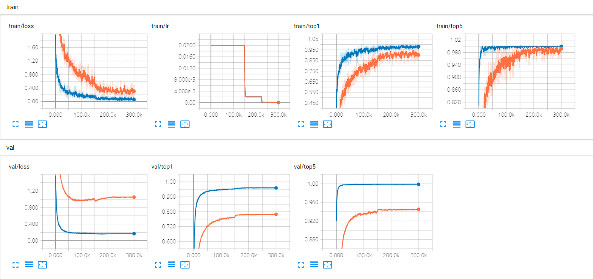

# FractalNet: Ultra-deep neural networks without residuals.

PyTorch Implementation of FractalNet.

Larsson, Gustav, Michael Maire, and Gregory Shakhnarovich. "Fractalnet: Ultra-deep neural networks without residuals." *arXiv preprint arXiv:1605.07648* (2016).


## Requirements

```bash
pip install -r requirements.txt
```

- python 3
- pytorch >= 0.4
- torchvision
- numpy, tensorboard, tensorboardX


## Usage

Default options are same as the paper, but I failed to reproduce the results of paper with the default options. So I've tried a lot to improve the performance and found a better option. `best` indicates this option.

```bash
# train (default)
python train.py --data cifar10 --name cifar10
# train (best)
python train.py --data cifar10 --name cifar10-best --init torch --gap 1 --pad reflect
```

For the test, you must specify the same name and same options that you used for the training. Some options are only required for training such as epochs, dropout, droppath, init, and data augmentation.

```bash
# test (for deepest)
python test.py --data cifar10 --name cifar10
python test.py --data cifar10 --name cifar10-best --init torch --gap 1 --pad reflect
```


### Run options

#### Train

```
$ python train.py --help
usage: Config [-h] --name NAME [--data DATA] [--batch_size BATCH_SIZE]
              [--lr LR] [--momentum MOMENTUM] [--print_freq PRINT_FREQ]
              [--gpu GPU] [--epochs EPOCHS] [--init_channels INIT_CHANNELS]
              [--gdrop_ratio GDROP_RATIO] [--p_ldrop P_LDROP]
              [--dropout_probs DROPOUT_PROBS] [--blocks BLOCKS]
              [--columns COLUMNS] [--seed SEED] [--workers WORKERS]
              [--aug_lv AUG_LV] [--off-drops] [--gap GAP] [--init INIT]
              [--pad PAD] [--doubling] [--gdrop_type GDROP_TYPE]
              [--dropout_pos DROPOUT_POS]

optional arguments:
  -h, --help            show this help message and exit
  --name NAME
  --data DATA           CIFAR10 (default) / CIFAR100
  --batch_size BATCH_SIZE
                        default: 100
  --lr LR               learning rate (default: 0.02)
  --momentum MOMENTUM
  --print_freq PRINT_FREQ
                        print frequency
  --gpu GPU             gpu device id
  --epochs EPOCHS       # of training epochs (default: 400)
  --init_channels INIT_CHANNELS
                        doubling each block except the last (default: 64)
  --gdrop_ratio GDROP_RATIO
                        ratio of global drop path (default: 0.5)
  --p_ldrop P_LDROP     local drop path probability (default: 0.15)
  --dropout_probs DROPOUT_PROBS
                        dropout probs for each block with comma separated
                        (default: 0.0, 0.1, 0.2, 0.3, 0.4)
  --blocks BLOCKS       default: 5
  --columns COLUMNS     default: 3
  --seed SEED           random seed
  --workers WORKERS     # of workers
  --aug_lv AUG_LV       data augmentation level (0~2). 0: no augmentation, 1:
                        horizontal mirroring + [-4, 4] translation, 2: 1 +
                        cutout.

Experiment:
  --off-drops           turn off all dropout and droppath
  --gap GAP             0: max-pool (default), 1: GAP - FC, 2: 1x1conv - GAP
  --init INIT           xavier (default) / he / torch (pytorch default)
  --pad PAD             zero (default) / reflect
  --doubling            turn on 1x1 conv channel doubling
  --gdrop_type GDROP_TYPE
                        ps (per-sample, various gdrop per block) / ps-consist
                        (default; per-sample, consist global drop)
  --dropout_pos DROPOUT_POS
                        CDBR (default; conv-dropout-BN-relu) / CBRD (conv-BN-
                        relu-dropout) / FD (fractal_block-dropout)
```

#### Test

```
$ python test.py --help
usage: Config [-h] --name NAME [--data DATA] [--batch_size BATCH_SIZE]
              [--print_freq PRINT_FREQ] [--gpu GPU]
              [--init_channels INIT_CHANNELS] [--blocks BLOCKS]
              [--columns COLUMNS] [--workers WORKERS] [--gap GAP] [--pad PAD]
              [--doubling] [--dropout_pos DROPOUT_POS]

optional arguments:
  -h, --help            show this help message and exit
  --name NAME
  --data DATA           CIFAR10 (default) / CIFAR100
  --batch_size BATCH_SIZE
                        default: 200
  --gpu GPU             gpu device id
  --init_channels INIT_CHANNELS
                        doubling each block except the last (default: 64)
  --blocks BLOCKS       default: 5
  --columns COLUMNS     default: 3
  --workers WORKERS     # of workers

Experiment:
  --gap GAP             0: max-pool (default), 1: GAP - FC, 2: 1x1conv - GAP
  --pad PAD             zero (default) / reflect
  --doubling            turn on 1x1 conv channel doubling
```


## Results

### Disclaimer

- The data augmentation method for C10++ is not described in the paper. Here I used the [Cutout](https://arxiv.org/abs/1708.04552) method in addition to horizontal mirroring and [-4, 4] translation.
- In C10++ and C100++, the epoch was increased to 600, if necessary.

### Best plots



Best results for CIFAR10 and CIFAR100. 3.91% and 21.64%, respectively.

### CIFAR10

| Method                | C10       | C10+      | C10++     |
| --------------------- | --------- | --------- | --------- |
| Default               | 12.07%    | 6.06%     | 5.05%     |
| ⠀⠀+ drop-path + dropout | 9.64%     | 6.44%     | 5.57%     |
| ⠀⠀⠀⠀=> deepest            | 10.14%    | 7.19%     | 5.85%     |
| Best                  | 10.87%    | 6.16%     | 5.19%     |
| ⠀⠀+ drop-path + dropout | **8.47%** | 6.04%     | 5.49%     |
| ⠀⠀⠀⠀=> deepest            | 9.47%     | 6.90%     | 6.09%     |
| Paper                 | 10.18%    | 5.22%     | 5.11%     |
| ⠀⠀+ drop-path + dropout | 7.33%     | 4.60%     | 4.59%     |
| ⠀⠀⠀⠀=> deepest            | 7.27%     | 4.68%     | 4.63%     |
| Best + FDO + local DP | 8.61%     | **5.25%** | **3.91%** |

As mentioned before, the results of the paper were not reproduced. After several attempts, I've got the `best` option, which is `--init torch --gap 1 --pad reflect`. The `best` option got about 1.2% better than the default.

Furthermore, I got better results with less regularization. The last row is that: "Best + FDO (Fractal dropout) + local DP (No global drop-path)". The run option is `--init torch --gap 1 --pad reflect --global_drop_ratio 0. --dropout_pos FD`.

### CIFAR100

| Method                              | C100       | C100+      | C100++     |
| ----------------------------------- | ---------- | ---------- | ---------- |
| Default                             |            |            |            |
| ⠀⠀+ drop-path + dropout | 34.04%     | 28.71%     | 27.73%     |
| ⠀⠀⠀⠀=> deepest                  | 36.69% | 31.95% | 30.66% |
| Best                                | 36.99%     |            |            |
| ⠀⠀+ drop-path + dropout | **31.84%** | 29.18%     | 29.04%     |
| ⠀⠀⠀⠀=> deepest                  | 34.75% | 32.45% | 32.41% |
| Paper                               | 35.34%     | 23.30%     | 22.85%     |
| ⠀⠀+ drop-path + dropout | 28.20%     | 23.73%     | 23.36%     |
| ⠀⠀⠀⠀=> deepest                  | 29.05%     | 24.32%     | 23.60%     |
| Best + FDO + local DP               | 32.11%     | **24.08%** | 22.02%     |
| Best + FDO + local DP + doubling    | 33.65%     | 24.36%     | **21.64%** |

Likewise C100, the paper results were not reproduced. In C100, I did not perform as many experiments as C10. But the results is similar - "Best + FDO + local DP" is better.

However, there are some difference: default option is better than `best` option in C100+ and C100++, and the doubling works better in C100 than in C10.


## ETC

- The Keras implementation [snf/keras-fractalnet](https://github.com/snf/keras-fractalnet) also failed to reproduce the results of the paper.
- If you are familiar with Korean, there are more discussions and results in [exp-note (kor)](./exp-note-kor.md).
