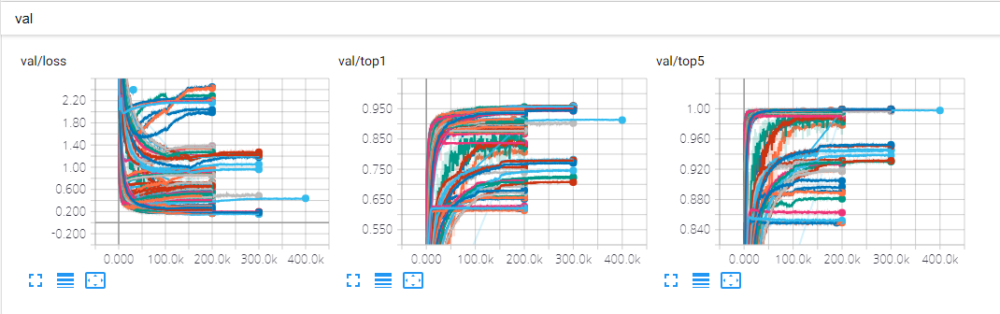

# 실험 노트

This page is written in Korean.

## Disclaimer

- 정확한 비교를 위해서는 반복 실험이 필요하지만 리소스의 부족으로 반복 실험까지 하지는 못하였음. 약간의 실험 오차가 있을 수 있다.
- Data augmentation 을 가장 많이 하는 C10++, C100++ 의 경우 논문에 구체적으로 어떻게 했는지 나와 있지 않기 때문에 여기서는 horizontal mirroring 과 [-4, 4] translation 외에 Cutout 을 추가로 적용하였음.
  - DeVries, Terrance, and Graham W. Taylor. “Improved regularization of convolutional neural networks with cutout.” *arXiv preprint arXiv:1708.04552* (2017).

## Intuition and results of options

- gap
  - 마지막에 max pooling 으로 1x1 으로 줄이는 것이 과하다고 판단하여 GAP 적용
  - "GAP - FC (fully-connected)" 방식과 "1x1 conv - GAP" 방식을 실험해 보았으나 전자가 조금 더 나았음
- init
  - 경험적으로 pytorch default init 이 잘 워킹하는 경우가 많았어서 적용
  - xavier, he, torch (pytorch default) 를 비교. torch 가 평균적으로 좋았고 xavier 도 괜찮았으나 he 는 좋지 않았음
- pad
  - 논문에 reflect padding 에 대한 언급이 나와서 적용
  - 처음에는 reflect padding 을 사용한 줄 알았으나 추후 다시 읽어보니 data augmentation 때만 사용했다는 얘기로 보임
  - zero padding 보다 결과가 좋았음
- doubling
  - 논문과 파라메터의 수치가 맞지 않음. 논문에서는 38.6M 이라고 되어 있으나 구현체의 경우 33.7M. 
  - 채널 크기는 마지막 블럭을 제외하고 블럭이 변경될 때마다 2배씩 증가함: [64, 128, 256, 512, 512]. `--doubling` 을 사용하지 않을 경우 각 블럭의 input 과 연결된 conv 연산들에서 2배로 증가시키며, `--doubling` 을 사용할 경우 블럭의 앞에 1x1 conv block 을 붙여서 2배로 증가시킴.
  - 이렇게 할 경우 38.9M 으로 논문과 유사한 수준의 파라메터를 사용
  - 대부분 효과를 보지 못했으나 C100++ 에서는 성능향상에 도움이 되었음
- gdrop_type
  - 본 구현체는 per-sample drop path 로 구현되어 있으나 (동일 배치에서도 gdrop 과 ldrop 이 나뉘며 샘플마다 다른 drop 을 가짐), 논문은 per-batch 로 보임. 처음에 per-batch 로 구현하였으나 성능 재현이 안 되어 per-sample 로 재구현.
    - per-batch 구현체: `fractal_pb.py`
    - per-batch 와 per-sample 의 성능차이는 그다지 보이지 않았음.
  - 블럭마다 다른 global drop path 를 갖는 ps (per-sample) 와 전부 동일한 ps-consist 두 옵션을 구현하였으나, ps-consist 가 더 성능이 좋은데다 논문도 ps-consist 인 것으로 보여 ps 는 많은 실험을 하지 않음.
- dropout_pos
  - 논문에는 dropout 의 위치 등의 정확한 적용 방법이 나와있지 않음. 공식 구현체에서는 모든 conv 블럭에 사용한 것으로 보임.
  - 처음에는 CDBR (Conv-Dropout-BN-ReLU) 과 CBRD (Conv-BN-ReLU-Dropout) 두 종류만 실험.
  - 이후 실험하다가 regularization 이 너무 강한 현상을 발견하여 dropout 을 Fractal block 에 하나씩만 붙이는 FD (Fractal-Dropout) 실험
  - CDBR 과 CBRD 는 결과에서 차이가 없었으며 data augmentation +, ++ 에서는 FD 가  다른 방법들보다 더 좋은 성능을 보였음

## Best option selection

- 논문 그대로 구현하였으나 논문의 성능이 재현되지 않았음
- 적당한 수준에서 수정하여 성능 개선을 도모

| Method        | C10   | Run option                                           |
| ------------- | ----- | ---------------------------------------------------- |
| Default       | 9.64% |                                                      |
| Best          | 8.47% | `--gap 1 --pad reflect --init torch`                 |
| Best-GAP0     | 8.79% | `--gap 0 --pad reflect --init torch`                 |
| Best-GAP2     | 8.71% | `--gap 2 --pad reflect --init torch`                 |
| Best-xavier   | 8.53% | `--gap 1 --pad reflect --init xavier`                |
| Best-he       | 8.64% | `--gap 1 --pad reflect --init he`                    |
| Best-zeropad  | 9.47% | `--gap 1 --pad zero --init torch`                    |
| Best-doubling | 9.13% | `--gap 1 --pad reflect --init torch --doubling`      |
| Best-ps       | 8.89% | `--gap 1 --pad reflect --init torch --gdrop_type ps` |

- Best 는 [init=torch, gap=1, pad=reflect] 였다. Best-xavier 도 유사한 성능을 보이지만 전체적으로 torch init 이 좋은 성능을 보였다.
- 이후 실험에서는 이 Best 구조를 기반으로 변형해 가며 실험하였다.

## CIFAR10

- DO: dropout
  - FDO: fractal-dropout
- DP: drop-path
- local DP: local drop-path only (no global drop)
- C10++ 의 경우, epoch 이 부족하다고 판단될 경우 600까지 늘려서 실험

| Method                           | C10       | C10+      | C10++     |
| -------------------------------- | --------- | --------- | --------- |
| Default                          | 12.07%    | 6.06%     | 5.05%     |
| Default + DO + DP                | 9.64%     | 6.44%     | 5.57%     |
|   => deepest                       | 10.14%    | 7.19%     | 5.85%     |
| Default + DO + local DP          | 9.52%     | 5.81%     | 4.48%     |
| Best                             | 10.87%    | 6.16%     | 5.19%     |
| Best + DO + DP                   | **8.47%** | 6.04%     | 5.49%     |
|   => deepest                       | 9.47%     | 6.90%     | 6.09%     |
| Best + DO + DP + doubling        | 9.09%     | 5.93%     | 5.09%     |
| Best + DO + local DP             | **8.47%** | 5.31%     | 4.20%     |
| Best + DO + local DP + doubling  | 8.87%     | 5.47%     | 4.09%     |
| Best + FDO + local DP            | 8.61%     | **5.25%** | **3.91%** |
| Best + FDO + local DP + doubling |           | 5.30%     | 3.96%     |
| Paper                            | 10.18%    | 5.22%     | 5.11%     |
| Paper + DO + DP                  | 7.33%     | 4.60%     | 4.59%     |
|   => deepest                       | 7.27%     | 4.68%     | 4.63%     |

- Default
  - 논문 그대로 구현
  - 성능이 1~2% 차이남
- Best
  - 여전히 약 1%정도 차이남
- local DP
  - Global drop-path 를 제외하고 local drop-path 만 사용 (`--global_drop_ratio 0.`)
  - C10++ 을 보면 DO + DP 를 적용한 것보다 적용하지 않은 것이 성능이 더 좋음
  - 이로부터 randomness (regularization) 가 너무 강한 것으로 판단하여 local DP (no global DP) 실험
  - C10+ 에서 0.7%, C10++ 에서 1% 의 성능개선. 다만 data augmentation 을 하지 않은 C10 에서는 global DP 를 적용하는 것이 더 성능이 좋았다.
- FDO
  - local DP 와 같은 맥락에서 dropout 도 모든 conv block 마다 붙이는 것이 너무 많다고 판단
  - fractal block 의 마지막에 하나만 붙임
  - 3%대 error rate 달성.
- Doubling
  - 전체적으로 큰 효과를 보지 못했으나 C10++ 에서는 약간씩 성능이 좋아지는 경우가 있었음

## CIFAR100

- C100++ 의 경우, epoch 이 부족하다고 판단될 경우 600까지 늘려서 실험

| Method                              | C100       | C100+      | C100++     |
| ----------------------------------- | ---------- | ---------- | ---------- |
| Default                             |            |            |            |
| Default + DO + DP                   | 34.04%     | 28.71%     | 27.73%     |
|   => deepest                          | 36.69%     | 31.95%     | 30.66%     |
| Default + FDO + local DP + doubling |            |            | 25.76%     |
| Best                                | 36.99%     |            |            |
| Best + DO + DP                      | **31.84%** | 29.18%     | 29.04%     |
|   => deepest                          | 34.75%     | 32.45%     | 32.41%     |
| Best + DO + DP + doubling           |            |            | 25.26%     |
| Best + DO + local DP                |            |            | 22.85%     |
| Best + DO + local DP + doubling     |            |            | 21.94%     |
| Best + FDO + local DP               | 32.11%     | **24.08%** | 22.02%     |
| Best + FDO + local DP + doubling    | 33.65%     | 24.36%     | **21.64%** |
| Paper                               | 35.34%     | 23.30%     | 22.85%     |
| Paper + DO + DP                     | 28.20%     | 23.73%     | 23.36%     |
|   => deepest                          | 29.05%     | 24.32%     | 23.60%     |

- 흥미로운 점은, C100+ 과 C100++ 에서 best 에 비해 default 가 좋은 성능을 보임
  - 그러나 local DP 등의 변주를 주었을 때에는 best 가 더 좋았음
- C10 에 비해 C100 에서는 doubling 이 보다 눈에 띄게 효과가 있었음
  - 더 어려운 문제인 만큼 파라메터의 수가 늘어나는 것이 효과를 본 것으로 보임

## 기타

- Pool-Join
  - 블럭의 마지막에 max-pool 을 먼저 하고 그 다음에 join 을 하는 방식
  - 논문의 설명은 Join-Pool 이지만 Implementation detail 에 Pool-Join 으로 구현하였다고 나옴.
  - 실험해보았으나 성능에 별반 차이가 없었음.
